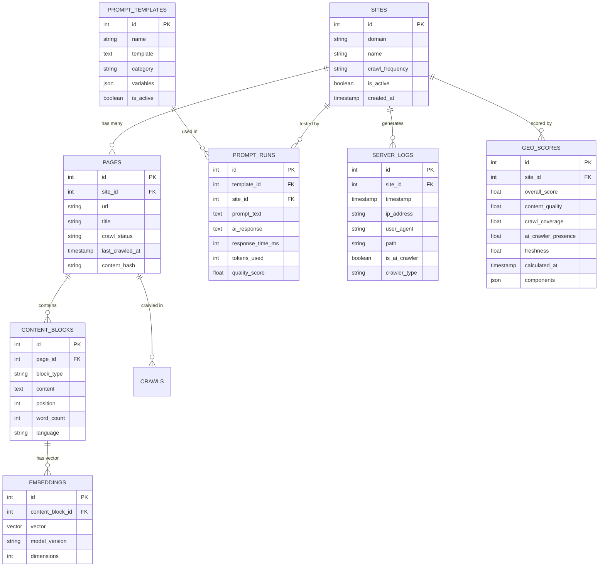

# GEO Platform: Integration Documentation - Part 3

## 6. Database Schema: The Information Foundation

### The Complete Data Model

Think of our database like a **well-organized library system**. Each table is like a different section of the library, and the relationships between tables are like the cross-references that help you find related information.

### Core Entities Explained

#### Sites Table (The Library Catalog)
**What it represents:** Each client website we're monitoring

**Plain English:** Like having a card in the library catalog for each bookstore we're tracking

**Technical Definition:** Stores metadata about client websites including domain, crawl settings, and configuration

**Key Fields:**
- `id`: Unique identifier (like a library card number)
- `domain`: Website URL (like "samsung.com")
- `name`: Human-readable name (like "Samsung Electronics")
- `crawl_frequency`: How often to check for updates (daily, weekly, monthly)
- `is_active`: Whether we're currently monitoring this site
- `created_at`: When we first started tracking this site

**Real-World Example:**
```json
{
  "id": 1,
  "domain": "samsung.com",
  "name": "Samsung Electronics",
  "crawl_frequency": "daily",
  "is_active": true,
  "created_at": "2024-01-15T10:00:00Z"
}
```

#### Pages Table (Individual Books)
**What it represents:** Every webpage we've crawled from each site

**Plain English:** Like having a record for each book in the library

**Technical Definition:** Stores individual page metadata including URL, title, and crawl status

**Key Fields:**
- `id`: Unique page identifier
- `site_id`: Which website this page belongs to (foreign key)
- `url`: Full URL of the page
- `title`: Page title from HTML
- `crawl_status`: Whether crawling succeeded, failed, or is pending
- `last_crawled_at`: When we last checked this page
- `content_hash`: Unique fingerprint of the page content

**Relationship:** A site has many pages (one-to-many)

#### Content Blocks Table (Book Chapters)
**What it represents:** Chunks of text content extracted from pages

**Plain English:** Like having separate records for each chapter or section of a book

**Technical Definition:** Stores parsed content blocks with metadata for AI processing

**Key Fields:**
- `id`: Unique block identifier
- `page_id`: Which page this content came from
- `block_type`: Type of content (heading, paragraph, list, etc.)
- `content`: The actual text content
- `position`: Order within the page
- `word_count`: Number of words in this block
- `language`: Detected language of the content

**Relationship:** A page has many content blocks (one-to-many)

#### Embeddings Table (Search Index)
**What it represents:** Vector representations of content for AI similarity search

**Plain English:** Like having a search index that can find similar content even if the words are different

**Technical Definition:** Stores vector embeddings generated from content blocks for RAG (Retrieval Augmented Generation)

**Key Fields:**
- `id`: Unique embedding identifier
- `content_block_id`: Which content block this represents
- `vector`: The actual embedding vector (array of numbers)
- `model_version`: Which AI model generated this embedding
- `dimensions`: Size of the vector (e.g., 1536 for OpenAI embeddings)

**Why we need this:** AI assistants can find relevant content even when questions use different words than the original content.

#### Prompt Templates Table (Survey Questions)
**What it represents:** Reusable question templates for testing AI performance

**Plain English:** Like having a library of survey questions we can ask AI assistants

**Technical Definition:** Stores prompt templates with variables for systematic AI testing

**Key Fields:**
- `id`: Unique template identifier
- `name`: Human-readable name (like "Best Phone Under Budget")
- `template`: The question template with variables
- `category`: Type of question (product comparison, feature inquiry, etc.)
- `variables`: JSON object defining template variables
- `is_active`: Whether this template is currently being used

**Example Template:**
```json
{
  "id": 1,
  "name": "Best Phone Under Budget",
  "template": "What's the best {product_type} under ${budget}?",
  "category": "product_comparison",
  "variables": {
    "product_type": ["smartphone", "laptop", "tablet"],
    "budget": [500, 1000, 1500]
  }
}
```

#### Prompt Runs Table (Survey Results)
**What it represents:** Individual executions of prompt templates with results

**Plain English:** Like having a record of each time we asked a survey question and got an answer

**Technical Definition:** Stores prompt execution details and AI responses

**Key Fields:**
- `id`: Unique run identifier
- `template_id`: Which template was used
- `site_id`: Which website this test was for
- `prompt_text`: The actual question asked
- `ai_response`: The AI assistant's answer
- `response_time_ms`: How long the AI took to respond
- `tokens_used`: Number of AI tokens consumed
- `quality_score`: Our assessment of response quality

#### Server Logs Table (Visitor Records)
**What it represents:** Individual log entries from website servers

**Plain English:** Like having a guest book that records every visitor to a store

**Technical Definition:** Stores processed server log entries with AI crawler detection

**Key Fields:**
- `id`: Unique log entry identifier
- `site_id`: Which website this log is from
- `timestamp`: When the visit occurred
- `ip_address`: Visitor's IP address (may be redacted)
- `user_agent`: Browser or bot identifier
- `path`: Which page was visited
- `is_ai_crawler`: Whether this was an AI bot
- `crawler_type`: Specific AI system (ChatGPT, Claude, etc.)

#### GEO Scores Table (Performance Report)
**What it represents:** Calculated performance scores for each website

**Plain English:** Like having a report card that shows how well each student is doing

**Technical Definition:** Stores calculated GEO scores with component breakdowns

**Key Fields:**
- `id`: Unique score identifier
- `site_id`: Which website this score is for
- `overall_score`: Combined GEO score (0-100)
- `content_quality`: Quality of content (0-100)
- `crawl_coverage`: How much of the site is crawled (0-100)
- `ai_crawler_presence`: How often AI bots visit (0-100)
- `freshness`: How recent the content is (0-100)
- `calculated_at`: When this score was calculated
- `components`: JSON object with detailed breakdown

### Database Relationship Diagram



### Why This Schema Design?

**Normalization Benefits:**
- **No Data Duplication:** Each piece of information is stored once
- **Consistency:** Changes to site info update everywhere automatically
- **Efficiency:** Smaller database size and faster queries

**Relationship Benefits:**
- **Easy Queries:** "Show me all pages for Samsung" becomes simple
- **Data Integrity:** Can't delete a site if it has pages
- **Flexibility:** Can add new relationships without changing existing data

**Indexing Strategy:**
- **Primary Keys:** All tables have auto-incrementing IDs
- **Foreign Keys:** All relationships are properly indexed
- **Search Fields:** URL, domain, and timestamp fields are indexed
- **Composite Indexes:** Common query patterns have multi-column indexes

---

## 7. GEO Scoring System: The Performance Calculator

### The Complete Scoring Framework

Think of GEO scoring like a **comprehensive fitness test**. Just like how a fitness test measures different aspects of health (cardio, strength, flexibility), our GEO score measures different aspects of AI visibility.

### The Four Core Components

#### 1. Content Quality (25% weight)
**What it measures:** How well-written and informative your content is

**Plain English:** Like grading an essay on clarity, completeness, and usefulness

**Technical Calculation:**
- **Readability Score:** Measures sentence length, word complexity
- **Completeness Score:** Checks for missing information (prices, specs, reviews)
- **Structure Score:** Evaluates headings, lists, and organization
- **Uniqueness Score:** Measures how original the content is

**Example Scoring:**
- **High Quality (90-100):** Clear, complete product descriptions with specs, reviews, and comparisons
- **Medium Quality (60-89):** Good content but missing some details or poorly organized
- **Low Quality (0-59):** Vague, incomplete, or poorly written content

**Real-World Example:**
```
Samsung Galaxy S24 product page:
- Readability: 85 (clear, concise descriptions)
- Completeness: 95 (has all specs, prices, reviews)
- Structure: 90 (well-organized with headings)
- Uniqueness: 80 (some generic marketing copy)
- Content Quality Score: 87.5
```

#### 2. Crawl Coverage (25% weight)
**What it measures:** How much of your website is being discovered and crawled

**Plain English:** Like measuring how much of a library's collection is catalogued and accessible

**Technical Calculation:**
- **Page Discovery Rate:** Percentage of pages found vs estimated total
- **Crawl Success Rate:** Percentage of pages successfully crawled
- **Depth Coverage:** How deep into the site structure we've crawled
- **Update Frequency:** How often pages are re-crawled for updates

**Example Scoring:**
- **High Coverage (90-100):** All important pages discovered and successfully crawled
- **Medium Coverage (60-89):** Most pages found but some failures or missing sections
- **Low Coverage (0-59):** Many pages missed or crawl failures

**Real-World Example:**
```
Samsung.com crawl results:
- Total pages discovered: 1,250
- Pages successfully crawled: 1,180
- Crawl success rate: 94.4%
- Pages updated in last 30 days: 340
- Crawl Coverage Score: 89.2
```

#### 3. AI Crawler Presence (25% weight)
**What it measures:** How often AI systems actually visit your website

**Plain English:** Like counting how many times different news reporters visit your store

**Technical Calculation:**
- **Crawler Frequency:** How often AI bots visit your site
- **Crawler Diversity:** How many different AI systems visit
- **Page Coverage:** Which pages the AI crawlers are visiting
- **Recency:** How recently AI crawlers were active

**Example Scoring:**
- **High Presence (90-100):** Daily visits from multiple AI systems
- **Medium Presence (60-89):** Regular visits from 2-3 AI systems
- **Low Presence (0-59):** Infrequent or no AI crawler activity

**Real-World Example:**
```
Samsung.com AI crawler activity (last 30 days):
- ChatGPT crawler visits: 45
- Claude crawler visits: 32
- Perplexity crawler visits: 28
- Total unique AI visits: 105
- AI Crawler Presence Score: 78.5
```

#### 4. Freshness (25% weight)
**What it measures:** How recent and up-to-date your content is

**Plain English:** Like checking if the milk in your fridge is still fresh

**Technical Calculation:**
- **Content Age:** How old the content is
- **Update Frequency:** How often content is updated
- **Relevance Score:** Whether content reflects current information
- **Seasonal Relevance:** Whether content is appropriate for current time

**Example Scoring:**
- **High Freshness (90-100):** Content updated within last week
- **Medium Freshness (60-89):** Content updated within last month
- **Low Freshness (0-59):** Content older than 3 months

**Real-World Example:**
```
Samsung Galaxy S24 content:
- Last updated: 2 days ago
- Content age score: 95
- Update frequency: Weekly
- Relevance: High (current model)
- Freshness Score: 92.3
```

### GEO Score Calculation Formula

**Overall GEO Score = (Content Quality × 0.25) + (Crawl Coverage × 0.25) + (AI Crawler Presence × 0.25) + (Freshness × 0.25)**

**Example Calculation:**
```
Samsung Galaxy S24:
- Content Quality: 87.5 × 0.25 = 21.875
- Crawl Coverage: 89.2 × 0.25 = 22.3
- AI Crawler Presence: 78.5 × 0.25 = 19.625
- Freshness: 92.3 × 0.25 = 23.075
- Overall GEO Score: 86.875
```

### GEO Score Interpretation

**Excellent (90-100):** Your content is highly visible in AI responses
- Content is comprehensive and well-written
- AI systems regularly crawl your site
- Information is current and relevant
- You're likely to appear in AI-generated answers

**Good (70-89):** Your content has good AI visibility
- Most aspects are strong with room for improvement
- AI systems visit regularly but not daily
- Content is generally current and useful

**Fair (50-69):** Your content has moderate AI visibility
- Some areas need improvement
- AI crawler activity is inconsistent
- Content may be outdated or incomplete

**Poor (0-49):** Your content has low AI visibility
- Significant improvements needed across all areas
- AI systems rarely or never visit
- Content is likely outdated or poorly structured

### GEO Score Calculation Flowchart

```mermaid
flowchart TD
    A[Start GEO Calculation] --> B[Gather Content Quality Data]
    B --> C[Calculate Readability Score]
    C --> D[Calculate Completeness Score]
    D --> E[Calculate Structure Score]
    E --> F[Calculate Uniqueness Score]
    F --> G[Combine for Content Quality]
    
    G --> H[Gather Crawl Coverage Data]
    H --> I[Calculate Page Discovery Rate]
    I --> J[Calculate Crawl Success Rate]
    J --> K[Calculate Depth Coverage]
    K --> L[Calculate Update Frequency]
    L --> M[Combine for Crawl Coverage]
    
    M --> N[Gather AI Crawler Data]
    N --> O[Calculate Crawler Frequency]
    O --> P[Calculate Crawler Diversity]
    P --> Q[Calculate Page Coverage]
    Q --> R[Calculate Recency]
    R --> S[Combine for AI Crawler Presence]
    
    S --> T[Gather Freshness Data]
    T --> U[Calculate Content Age]
    U --> V[Calculate Update Frequency]
    V --> W[Calculate Relevance Score]
    W --> X[Calculate Seasonal Relevance]
    X --> Y[Combine for Freshness]
    
    Y --> Z[Apply Weights and Calculate Final Score]
    Z --> AA[Store GEO Score in Database]
    AA --> BB[End]
    
    style A fill:#e1f5fe
    style BB fill:#e8f5e8
    style Z fill:#fff3e0
```



### Why These Four Components?

**Content Quality:** Without good content, AI systems have nothing valuable to reference
**Crawl Coverage:** If AI systems can't find your content, they can't use it
**AI Crawler Presence:** Real-world validation that AI systems are actually interested
**Freshness:** Outdated information hurts credibility and usefulness

### Score Updates and Monitoring

**Update Frequency:**
- **Real-time:** When new content is crawled
- **Daily:** AI crawler presence scores
- **Weekly:** Full recalculation for all sites
- **Monthly:** Historical trend analysis

**Monitoring Alerts:**
- **Score Drops:** Alert when GEO score decreases by 10+ points
- **Crawler Issues:** Alert when AI crawler presence drops significantly
- **Content Staleness:** Alert when content hasn't been updated in 30+ days
- **Crawl Failures:** Alert when crawl success rate drops below 80%

---

*[This is Part 3 of the comprehensive integration documentation. The next parts will cover UI/UX documentation, error handling, and implementation details.]*
